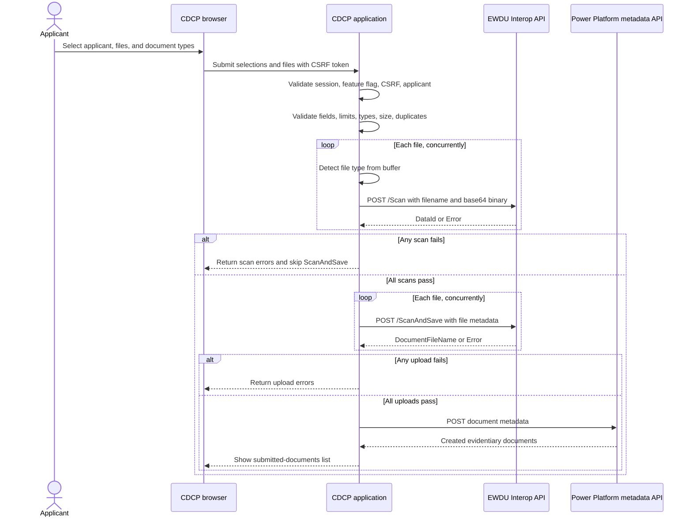

# Document Upload Feature

## Contents

- [Purpose and Summary](#purpose-and-summary)
- [Key Terms](#key-terms)
- [Scope and Access](#scope-and-access)
- [End-to-End Process](#end-to-end-process)
  - [Submission and validation](#1-submission-and-validation)
  - [EWDU processing](#2-ewdu-processing)
  - [Power Platform metadata and retrieval](#3-power-platform-metadata-and-retrieval)
- [Filename and Data Sharing](#filename-and-data-sharing)
  - [Filename handling](#filename-handling)
  - [Data collected and shared](#data-collected-and-shared)
  - [Data kept for validation or control](#data-kept-for-validation-or-control)
- [Implementation Touch Points](#implementation-touch-points)
- [Configuration, Security, and Operations](#configuration-security-and-operations)
  - [Runtime settings](#runtime-settings)
  - [Retry behavior](#retry-behavior)
  - [Security and privacy](#security-and-privacy)
- [Failure and Consistency Behavior](#failure-and-consistency-behavior)

## Purpose and Summary

This document describes the current Canadian Dental Care Plan (CDCP) protected document upload implementation. It is a shared reference for business, support, and technical teams working with Enterprise Wide Document Upload (EWDU) and Power Platform.

**Status:** Current implementation reference, reviewed 2026-07-21.

The feature is a protected MSCA workflow for submitting evidentiary documents for the authenticated applicant. The browser sends file data to the CDCP server; it does not send files directly to EWDU or Power Platform:

1. The user selects an applicant, files, and document types.
2. The CDCP server validates the submission and computes SHA-256 hashes for duplicate detection.
3. The server checks each file extension and detected content type.
4. The server sends each file to EWDU through the Interop API `Scan` operation.
5. Only after every file passes scanning does the server send the files to EWDU through `ScanAndSave`.
6. After all file uploads succeed, the server creates evidentiary-document metadata in Power Platform.
7. The submitted-documents list retrieves metadata from Power Platform.

Binary transfer and metadata creation use separate integrations. EWDU owns threat scanning and the predetermined drop location. Power Platform owns the evidentiary-document metadata shown in the CDCP submitted-documents list.

## Key Terms

| Term                 | Meaning                                                                                                          |
| -------------------- | ---------------------------------------------------------------------------------------------------------------- |
| CDCP                 | Canadian Dental Care Plan.                                                                                       |
| MSCA                 | My Service Canada Account, the authenticated portal used to access this feature.                                 |
| EWDU                 | Enterprise Wide Document Upload, the service that scans files and saves them to its predetermined drop location. |
| Interop API          | Integration layer used by CDCP to communicate with EWDU and Power Platform.                                      |
| Power Platform       | System that stores evidentiary-document metadata and provides the submitted-documents list data.                 |
| Client ID            | Power Platform identifier for the applicant record.                                                              |
| Client number        | Applicant identifier sent to EWDU as `subjectPersonIdentificationID`.                                            |
| Evidentiary document | Document submitted as evidence for a CDCP applicant.                                                             |

## Scope and Access

| Area                        | Current behavior                                                                                               |
| --------------------------- | -------------------------------------------------------------------------------------------------------------- |
| Feature flag                | `doc-upload` must be enabled.                                                                                  |
| Protected upload page       | `/en/protected/documents/upload` and `/fr/protege/documents/televerser`                                        |
| Submitted-document list     | `/en/protected/documents` and `/fr/protege/documents`                                                          |
| Documents-not-required page | `/en/protected/documents/not-required` and `/fr/protege/documents/non-requis`                                  |
| Supported target            | Primary enrolled applicant only. Child records are mapped server-side but are not currently offered in the UI. |
| Source route                | [`app/routes/protected/documents/upload.tsx`](../../app/routes/protected/documents/upload.tsx)                 |

On page access, the server validates the feature flag, authenticated session, client application, and enrolled-applicant status. It redirects to the documents-not-required page when requirements are not met, loads applicant and document-type choices, and loads the dashboard URL.

## End-to-End Process



### 1. Submission and validation

The user selects an applicant, one or more files, and a document type for each file. The application submits the selections and files to the server as a multipart request protected by a CSRF token. The browser provides immediate feedback, but the server repeats validation with server configuration and remains the security boundary.

The same validation rules apply in the browser and on the server. Current defaults:

| Setting            | Current default                                           | Source                                    |
| ------------------ | --------------------------------------------------------- | ----------------------------------------- |
| Allowed extensions | `.docx`, `.pptx`, `.txt`, `.pdf`, `.jpg`, `.jpeg`, `.png` | `DOCUMENT_UPLOAD_ALLOWED_FILE_EXTENSIONS` |
| Maximum file size  | 5 MB per file                                             | `DOCUMENT_UPLOAD_MAX_FILE_SIZE_MB`        |
| Maximum file count | 10 files per submission                                   | `DOCUMENT_UPLOAD_MAX_FILE_COUNT`          |

Validation rules include:

- An applicant is required.
- At least one file is required.
- The number of files must not exceed the configured maximum.
- The filename extension must be allowed.
- The file size must not exceed the configured maximum.
- A document type is required for every file.
- Duplicate files are rejected using the filename, size, and SHA-256 hash.
- The file content is inspected with `file-type` when scanning. If no type is detected, only a declared `text/plain` file is accepted. A detected MIME type must map to one of the configured extensions.

The server reads each file while parsing the submission, computes its SHA-256 hash, and converts the binary to base64 for downstream requests.

### 2. EWDU processing

#### Scan

For each validated file, the server calls `DocumentUploadService.scanDocument()`. The service maps the request to EWDU format and calls `DocumentUploadRepository.scanDocument()`.

All file scans run concurrently. The server waits for the complete batch and returns errors for failed files. Any scan failure stops the upload phase for the entire submission.

A scan request sent to EWDU has this logical shape:

```json
{
  "filename": "evidence.pdf",
  "binary": "<base64 file bytes>",
  "username": "<EWDU encapsulation username>",
  "password": "<EWDU encapsulation password>",
  "programActivityIdentificationID": "<program activity ID>"
}
```

The current adapter sends this request to:

```text
POST {INTEROP_API_BASE_URI}/client-correspondence/document-upload/cct/v1/api/Scan
```

Headers:

- `Content-Type: application/json`
- `Ocp-Apim-Subscription-Key: {INTEROP_API_SUBSCRIPTION_KEY}`

The successful response contains `DataId`; a downstream error contains `ErrorCode` and `ErrorMessage`. Non-success HTTP responses are logged and raised as exceptions. The application converts caught failures into a localized generic scan error.

#### ScanAndSave

After the complete scan batch succeeds, the server sends each file through `DocumentUploadService.uploadDocument()`. The service resolves the selected document type ID to its configured code, maps the request to EWDU format, and calls the repository.

The upload request has this logical shape:

```json
{
  "filename": "evidence.pdf",
  "binary": "<base64 file bytes>",
  "subjectPersonIdentificationID": "<client number>",
  "documentCategoryText": "<document type code>",
  "originalDocumentCreationDate": "2026-07-21T00:00:00.000Z",
  "username": "<EWDU encapsulation username>",
  "password": "<EWDU encapsulation password>",
  "programActivityIdentificationID": "<program activity ID>"
}
```

The current adapter sends this request to:

```text
POST {INTEROP_API_BASE_URI}/client-correspondence/document-upload/cct/v1/api/ScanAndSave
```

Headers and error handling match the scan operation. The successful response contains `DocumentFileName`.

The client number comes from the selected applicant ID. `documentCategoryText` is not the display label; it is the code loaded by `EvidentiaryDocumentTypeService` for the selected Power Platform document-type ID.

### 3. Power Platform metadata and retrieval

After every EWDU upload succeeds, the server sends a separate metadata request through `EvidentiaryDocumentService`.

The server obtains the first configured document-upload reason from `DocumentUploadReasonService`; every document in the batch receives that reason. The server sets the record source from `EWDU_RECORD_SOURCE_MSCA`; the default is `775170004` (MSCA).

The Power Platform adapter posts to:

```text
POST {INTEROP_API_BASE_URI}/dental-care/doc-metadata/pp/v1/esdc_clients({clientId})/Microsoft.Dynamics.CRM.esdc_UploadEvidentiaryDocuments
```

The request body has this logical shape:

```json
{
  "Documents": [
    {
      "@odata.type": "#Microsoft.Dynamics.CRM.esdc_evidentiarydocument",
      "esdc_DocumentTypeid@odata.bind": "esdc_documenttypes(<document type ID>)",
      "esdc_DocumentUploadReasonid@odata.bind": "esdc_documentuploadreasons(<reason ID>)",
      "esdc_recordsource": 775170004,
      "esdc_filename": "evidence.pdf",
      "esdc_uploaddate": "2026-07-21T00:00:00.000Z"
    }
  ]
}
```

The request uses the Interop API subscription key and JSON. `clientId` appears in the `esdc_clients({clientId})` URL segment. The metadata request contains no binary file.

After metadata creation succeeds, the application shows the submitted-documents list. The list reads active evidentiary documents from Power Platform using:

```text
GET {INTEROP_API_BASE_URI}/dental-care/doc-metadata/pp/v1/esdc_evidentiarydocuments
```

The query filters by selected client ID and active status, expands client and document-type relationships, and orders by upload date descending and filename ascending. The UI displays filename, applicant, localized document type name, and upload date.

## Filename and Data Sharing

### Filename handling

The application does not generate a business filename. It preserves the original `File.name` supplied by the browser when the user selects or drops a file.

- `file_id` is an internal identifier generated with `crypto.randomUUID()`. It tracks the selected file in the UI and error responses; it is not sent to EWDU or Power Platform.
- The original filename is used for extension validation, duplicate detection, EWDU requests, and Power Platform metadata.
- The server does not rename, sanitize, or add a timestamp to the filename before sending it downstream.
- The upload timestamp is generated separately by the server. It is not derived from the filename or the file's local creation date.

### Data collected and shared

In simple terms, the file content goes to EWDU. Document metadata goes to Power Platform. CDCP keeps additional control values for validation and request security.

| Data                      | Collected or derived from                                  | EWDU                                                        | Power Platform                                | Notes                                                   |
| ------------------------- | ---------------------------------------------------------- | ----------------------------------------------------------- | --------------------------------------------- | ------------------------------------------------------- |
| Original filename         | Browser `File.name`                                        | `filename` in `Scan` and `ScanAndSave`                      | `esdc_filename` in metadata and list response | Preserved unchanged.                                    |
| File binary               | Browser-selected file                                      | Base64 `binary` in `Scan` and `ScanAndSave`                 | Not sent                                      | Server converts the file buffer to base64.              |
| Applicant `clientId`      | Authenticated client application and user selection        | Used server-side to resolve client number                   | `esdc_clients({clientId})` URL                | Not included in EWDU scan request.                      |
| Applicant client number   | Authenticated client application                           | `subjectPersonIdentificationID` in `ScanAndSave`            | Not in metadata body                          | Identifies the EWDU upload subject.                     |
| Document type ID          | Power Platform document-type lookup and user selection     | Resolved to `documentCategoryText` code                     | `esdc_DocumentTypeid@odata.bind`              | EWDU receives code; Power Platform receives ID binding. |
| Document upload reason ID | Power Platform lookup; first configured reason is selected | Not sent                                                    | `esdc_DocumentUploadReasonid@odata.bind`      | User does not select reason.                            |
| Record source             | `EWDU_RECORD_SOURCE_MSCA` configuration                    | Not sent                                                    | `esdc_recordsource`                           | Current default: `775170004`.                           |
| Upload timestamp          | Server-generated current date/time                         | `originalDocumentCreationDate`                              | `esdc_uploaddate`                             | Separate from filename and local file metadata.         |
| EWDU credentials          | Server configuration                                       | Username, password, and program activity ID in request body | Not sent                                      | Deployment-managed values.                              |
| Interop subscription key  | Server configuration                                       | HTTP header                                                 | HTTP header                                   | Used to authenticate both integrations.                 |

### Data kept for validation or control

The following values are used by the CDCP server but are not included in EWDU or Power Platform request payloads:

- File size, used for the maximum-size check.
- Declared MIME type and detected file type, used for content validation.
- SHA-256 file hash, used for duplicate detection.
- CSRF token, used to protect the submission.
- Internal `file_id`, used to associate UI errors with selected files.

Power Platform later returns document metadata, client display names, and localized document-type names for the submitted-documents list. This is retrieval for display, not another file upload.

## Implementation Touch Points

Technical reference for developers and integration teams. Key implementation files:

- [`upload.tsx`](../../app/routes/protected/documents/upload.tsx): upload page access, validation, scan/upload orchestration, and metadata orchestration.
- [`document-upload.service.ts`](../../app/.server/domain/services/document-upload.service.ts): EWDU service facade.
- [`document-upload.repository.ts`](../../app/.server/domain/repositories/document-upload.repository.ts): EWDU HTTP URLs, headers, credentials, retries, and response handling.
- [`document-upload.dto.ts`](../../app/.server/domain/dtos/document-upload.dto.ts): scan and upload DTO contracts.
- [`document-upload.dto.mapper.ts`](../../app/.server/domain/mappers/document-upload.dto.mapper.ts): maps CDCP DTOs to EWDU request fields and resolves document-type codes.
- [`evidentiary-document.repository.ts`](../../app/.server/domain/repositories/evidentiary-document.repository.ts): Power Platform metadata GET/POST operations.
- [`evidentiary-document.service.ts`](../../app/.server/domain/services/evidentiary-document.service.ts): metadata service facade.
- [`env.utils.ts`](../../app/.server/utils/env.utils.ts): server-side integration and upload configuration schema.
- [`application-routes-reference.md`](./application-routes-reference.md): protected document route list.

The production bindings are configured through Inversify. `DefaultDocumentUploadRepository` is used unless the `document-upload` mock is enabled; the mock returns successful scan and upload responses without calling EWDU.

## Configuration, Security, and Operations

### Runtime settings

| Setting                                   | Purpose                                            | Current default or source                |
| ----------------------------------------- | -------------------------------------------------- | ---------------------------------------- |
| `INTEROP_API_BASE_URI`                    | Base URI for EWDU and Power Platform Interop APIs  | Required; environment-specific           |
| `INTEROP_API_SUBSCRIPTION_KEY`            | Subscription key used by both adapters             | Required; secret                         |
| `INTEROP_API_MAX_RETRIES`                 | Retry count for configured transient HTTP failures | `3`                                      |
| `INTEROP_API_BACKOFF_MS`                  | Retry backoff                                      | `100` ms                                 |
| `HTTP_PROXY_URL`                          | Optional proxy used by the HTTP client             | Environment-specific                     |
| `EWDU_ENCAPSULATION_USERNAME`             | Credential added to EWDU request bodies            | `CDCP`                                   |
| `EWDU_ENCAPSULATION_PASSWORD`             | Credential added to EWDU request bodies            | Optional schema value; deployment secret |
| `EWDU_PROGRAM_ACTIVITY_ID`                | EWDU program activity identifier                   | `CDCP`                                   |
| `EWDU_RECORD_SOURCE_MSCA`                 | Power Platform metadata record-source value        | `775170004`                              |
| `DOCUMENT_UPLOAD_ALLOWED_FILE_EXTENSIONS` | Browser and server extension allow-list            | `.docx,.pptx,.txt,.pdf,.jpg,.jpeg,.png`  |
| `DOCUMENT_UPLOAD_MAX_FILE_SIZE_MB`        | Browser and server per-file size limit             | `5`                                      |
| `DOCUMENT_UPLOAD_MAX_FILE_COUNT`          | Browser and server batch limit                     | `10`                                     |

The browser reads upload limits from client-exposed configuration, while the server reads them from server configuration. A deployment change must update both exposed and server-side values consistently, or users may see one set of rules while the server enforces another.

The repository uses the shared Interop API subscription key for the EWDU and Power Platform metadata requests. The EWDU username, password, and program activity ID are added to EWDU request bodies by the repository adapter. They should remain deployment-managed secrets/configuration and must not be moved into client-exposed environment variables.

### Retry behavior

| Operation                    | Retryable statuses currently configured |
| ---------------------------- | --------------------------------------- |
| EWDU `Scan`                  | 502, 503, 504                           |
| EWDU `ScanAndSave`           | 502, 503, 504                           |
| Power Platform metadata POST | 502                                     |
| Power Platform document GET  | 502                                     |

Retries occur inside the shared instrumented HTTP client. The application does not implement a transaction, compensation, or resume token.

### Security and privacy

- Feature flag and authenticated-session checks run on page access and submission.
- The server validates the CSRF token before processing the multipart request.
- The selected client ID is resolved against the authenticated client application and then translated to a client number for EWDU.
- File bytes are sent from the server to downstream services as base64 JSON; they are not logged by the application or repository.
- The repository uses an Interop API subscription key and EWDU encapsulation credentials.
- The frontend does not trust browser validation; the server repeats all upload validation.

## Failure and Consistency Behavior

The current implementation is batch-oriented but not transactional across systems:

- Validation failure: no downstream calls are made.
- Any scan failure: no file is sent to `ScanAndSave`.
- Upload failure for one file: other concurrent uploads may already have succeeded. The application returns errors and does not create metadata for the batch.
- Metadata failure after successful EWDU uploads: the files may already be in the EWDU drop location, while their Power Platform metadata is absent. The application returns an error rather than showing the submitted-documents list.
- A browser retry after a partial failure can submit already-uploaded files again because there is no idempotency key in the current upload contract.
- A successful metadata response is not used to build the list view; the application sends the user to the list and relies on a later Power Platform GET.
- `createMetadata()` selects the first document-upload reason returned by the lookup service. There is no user-selected reason in the current UI.

These behaviors are important acceptance criteria for any EWDU or Power Platform change. A change that introduces asynchronous processing, new response states, resumability, or idempotency will require updates to server-side orchestration and the user-facing status model, not only an adapter change.
