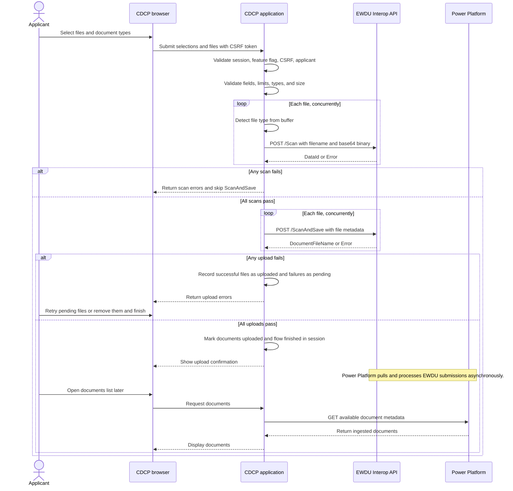

# Document Upload Feature

## Contents

- [Purpose and Summary](#purpose-and-summary)
- [Key Terms](#key-terms)
- [Scope and Access](#scope-and-access)
- [Upload Scenarios](#upload-scenarios)
  - [Access and flow lifecycle](#access-and-flow-lifecycle)
  - [File selection and editing](#file-selection-and-editing)
  - [Validation, scanning, and uploading](#validation-scanning-and-uploading)
  - [Recovery and completion](#recovery-and-completion)
  - [Navigation and refresh](#navigation-and-refresh)
- [End-to-End Process](#end-to-end-process)
  - [Submission and validation](#1-submission-and-validation)
  - [EWDU processing](#2-ewdu-processing)
  - [Power Platform background ingestion and retrieval](#3-power-platform-background-ingestion-and-retrieval)
- [Filename and Data Sharing](#filename-and-data-sharing)
  - [Filename handling](#filename-handling)
  - [Data collected and shared](#data-collected-and-shared)
  - [Data kept for validation or control](#data-kept-for-validation-or-control)
- [Implementation Touch Points](#implementation-touch-points)
- [Configuration, Security, and Operations](#configuration-security-and-operations)
  - [Runtime settings](#runtime-settings)
  - [Retry behavior](#retry-behavior)
  - [Security and privacy](#security-and-privacy)
- [Failure and Consistency Behavior](#failure-and-consistency-behavior)

## Purpose and Summary

This document describes the current Canadian Dental Care Plan (CDCP) protected document upload implementation. It is a shared reference for business, support, and technical teams working with Enterprise Wide Document Upload (EWDU) and Power Platform.

**Status:** Current implementation reference, reviewed 2026-10-09.

The feature is a protected MSCA workflow for submitting evidentiary documents for the authenticated applicant. The browser sends file data to the CDCP server, which validates and submits files to EWDU:

1. The user selects files and a document type for each file.
2. The CDCP server validates the submission and computes a SHA-256 hash for each file. Files with matching filenames, sizes, and contents are rejected as duplicates.
3. The server checks each file extension and detected content type.
4. The server sends each file to EWDU through the Interop API `Scan` operation.
5. Only after every file passes scanning does the server send the files to EWDU through `ScanAndSave`.
6. The server records per-file outcomes in the session. Successful files remain uploaded if other files fail; retries submit only pending files. When all pending uploads succeed, or the user removes the remaining files and explicitly finishes, the server shows confirmation for the successful uploads.
7. Power Platform pulls and processes EWDU submissions asynchronously. The documents list shows records after that process makes them available.

EWDU owns threat scanning and the predetermined drop location. Power Platform owns downstream ingestion and the evidentiary-document records shown in the CDCP documents list. DTS does not create Power Platform metadata as part of the synchronous upload request.

## Key Terms

| Term                 | Meaning                                                                                                          |
| -------------------- | ---------------------------------------------------------------------------------------------------------------- |
| CDCP                 | Canadian Dental Care Plan.                                                                                       |
| MSCA                 | My Service Canada Account, the authenticated portal used to access this feature.                                 |
| EWDU                 | Enterprise Wide Document Upload, the service that scans files and saves them to its predetermined drop location. |
| Interop API          | Integration layer used by CDCP to communicate with EWDU and Power Platform.                                      |
| Power Platform       | System that stores evidentiary-document metadata and provides the submitted-documents list data.                 |
| Client ID            | Power Platform identifier for the applicant record.                                                              |
| Client number        | Applicant identifier sent to EWDU as `subjectPersonIdentificationID`.                                            |
| Evidentiary document | Document submitted as evidence for a CDCP applicant.                                                             |

## Scope and Access

| Area                        | Current behavior                                                                                                                        |
| --------------------------- | --------------------------------------------------------------------------------------------------------------------------------------- |
| Feature flag                | `doc-upload` must be enabled.                                                                                                           |
| Protected upload page       | `/en/protected/documents/upload` and `/fr/protege/documents/televerser`                                                                 |
| Submitted-document list     | `/en/protected/documents` and `/fr/protege/documents`                                                                                   |
| Documents-not-required page | `/en/protected/documents/not-required` and `/fr/protege/documents/non-requis`                                                           |
| Supported target            | Primary enrolled applicant only. Child records are mapped server-side but are not currently offered in the UI.                          |
| Source route                | [`upload-index.tsx`](../../app/routes/protected/documents/upload/upload-index.tsx) starts a flow and redirects to its ID-specific form. |

The upload uses the authenticated applicant context; there is no applicant selector in the current form. The upload layout checks `AppealUploadEligibilityService`: an absent eligibility result or `canUploadAppealDocuments: false` redirects to the documents-not-required page. The layout describes eligible applicants as having an application paused due to a T4 mismatch. The form loads active, localized document types and the dashboard URL.

The instructions offer three kinds of evidence: a completed CDCP Member Eligibility Review Form (recommended), a letter or email from an employer or pension plan, or another document showing no access to private dental insurance or coverage. They request the applicant's matching first and last name, CDCP Member ID, and an authorized signature. These are guidance, not automated document-content checks.

## Upload Scenarios

These scenarios describe the current implementation, not proposed requirements. A flow has status `initialized`, `partial-upload`, or `finished`; each listed file is `pending` or `uploaded`. An uploaded-only selection remains `partial-upload` until explicit completion.

### Access and flow lifecycle

| Scenario                                                   | Outcome                                                                                                       |
| ---------------------------------------------------------- | ------------------------------------------------------------------------------------------------------------- |
| Eligible applicant enters the upload entry route           | Creates a new UUID-keyed session flow with no documents and replaces the URL with the flow-specific form URL. |
| Eligibility is absent or does not permit uploads           | Redirects to the documents-not-required page.                                                                 |
| Flow ID is invalid or the session record is unavailable    | Replaces the URL with the localized documents listing.                                                        |
| User revisits a finished form, including a POST            | Middleware redirects to that flow's confirmation before its loader or action runs.                            |
| User opens confirmation for an initialized or partial flow | Redirects to the documents listing; partial success alone does not permit confirmation.                       |
| User opens or refreshes a finished confirmation            | Shows successful filenames from the session, next steps, and a notice that account visibility may be delayed. |

### File selection and editing

| Scenario                                                                                     | Outcome                                                                                                                                             |
| -------------------------------------------------------------------------------------------- | --------------------------------------------------------------------------------------------------------------------------------------------------- |
| User selects a valid file                                                                    | Client-side selection validation adds it as pending with an empty document type; focus moves to the new item.                                       |
| User adds more files                                                                         | Appends them without discarding existing files or document types. The native picker selects one file at a time; this form renders no drop zone.     |
| User cancels the picker                                                                      | Leaves the selection unchanged.                                                                                                                     |
| Incoming selection exceeds the maximum                                                       | Rejects the entire proposed selection. Pending and uploaded files both count toward the limit.                                                      |
| Incoming selection contains an unsupported extension or oversized file                       | Rejects the entire proposed selection and displays the first selection error. A file exactly at the size limit passes size validation.              |
| Incoming selection contains a duplicate, or duplicates any listed file                       | Rejects the entire proposed selection, including duplicates of already-uploaded files.                                                              |
| Files have identical contents but different names, or identical names but different contents | Not duplicates: filename, size, and SHA-256 hash must all match.                                                                                    |
| User changes a pending file's document type                                                  | Updates that file only; active localized types are offered by the selector.                                                                         |
| User cancels or dismisses the removal dialog                                                 | Keeps the pending file.                                                                                                                             |
| User explicitly confirms removal                                                             | Removes that pending file; focus moves to the next or preceding pending item, the uploaded-only status region, or the upload trigger.               |
| File has already uploaded successfully                                                       | Shows its filename, document type, and success status without type-editing or removal controls. An unavailable type label has a localized fallback. |
| Selection validation response is stale                                                       | Only the response matching the current validation ID can add files.                                                                                 |

### Validation, scanning, and uploading

| Scenario                                                                                                       | Outcome                                                                                                                               |
| -------------------------------------------------------------------------------------------------------------- | ------------------------------------------------------------------------------------------------------------------------------------- |
| User submits an empty selection                                                                                | Client validation displays a required-file error without invoking the server action.                                                  |
| Pending file has no document type                                                                              | Displays a file-specific document-type error; no scan or upload occurs.                                                               |
| Submitted batch has an invalid extension, oversized file, excessive count, or duplicate files                  | Client validation blocks submission; the server repeats validation if invoked.                                                        |
| Upload payload has no file IDs, mismatched IDs and file objects, blank IDs, non-file objects, or duplicate IDs | Server returns HTTP 400 before processing file bytes.                                                                                 |
| Submitted ID belongs to an already-uploaded file in this flow                                                  | Server returns HTTP 409 without changing state.                                                                                       |
| Detected content type is not allowed                                                                           | Returns a file-specific type error before that file's security scan; none of the pending batch uploads.                               |
| Content type cannot be detected                                                                                | Only declared `text/plain` passes the content-type fallback; otherwise the file is rejected.                                          |
| Security service rejects one or more files                                                                     | Returns file-specific security errors and skips the upload phase for the entire pending batch.                                        |
| Content checking or security scanning throws                                                                   | Returns an unexpected scan error for the affected file and skips the batch's upload phase.                                            |
| Every pending file passes scanning and uploading                                                               | Marks files uploaded, finishes the flow, and replaces the form URL with confirmation.                                                 |
| Every upload fails                                                                                             | Keeps all submitted files pending and returns file-specific upload errors.                                                            |
| Some uploads succeed and others fail                                                                           | Retains successful files as uploaded and failed files as pending, preserving selection order; returns errors rather than redirecting. |
| Upload service returns an error or throws                                                                      | Displays the corresponding upload-failed or unexpected-upload-error message for that file. Other concurrent uploads may succeed.      |

### Recovery and completion

| Scenario                                                                                            | Outcome                                                                                                                                                                |
| --------------------------------------------------------------------------------------------------- | ---------------------------------------------------------------------------------------------------------------------------------------------------------------------- |
| User retries after scan failure                                                                     | Revalidates and rescans all pending files.                                                                                                                             |
| User retries after partial upload                                                                   | Sends only pending files; successful files are not scanned or uploaded again. The UI shows separate uploaded and remaining counts and a Submit remaining files action. |
| User adds files after partial success                                                               | Retains successful uploads and appends new pending files, subject to selection limits and duplicate checks.                                                            |
| User changes types or removes failed files before retrying                                          | Uses the current pending selection; the next validated submission replaces obsolete pending session metadata while retaining successful uploads.                       |
| User removes every failed file after partial success                                                | Shows an uploaded-only success region with no files awaiting upload and a View submission confirmation action. Removing files does not itself finish the flow.         |
| User finishes an uploaded-only selection                                                            | Sends a metadata-only `finish` request; the server removes stale pending metadata and redirects to confirmation without scanning or uploading files.                   |
| User finishes without any successful uploads, or an already-finished flow reaches the finish action | Returns HTTP 409. Normal finished-route access is redirected by middleware first.                                                                                      |
| Finish payload contains file IDs, file objects, or any non-string value                             | Returns HTTP 400.                                                                                                                                                      |
| User removes all files with no successful uploads                                                   | Returns to an empty form; submission still requires a file.                                                                                                            |

### Navigation and refresh

| Scenario                                                                                        | Outcome                                                                                                                                                          |
| ----------------------------------------------------------------------------------------------- | ---------------------------------------------------------------------------------------------------------------------------------------------------------------- |
| User attempts client-side navigation to a different pathname with pending files                 | Opens a confirmation dialog. Stay, Escape, or dialog dismissal cancels navigation and restores focus; explicit Leave proceeds.                                   |
| User refreshes, closes, or otherwise unloads the browser page with pending files                | Requests the browser's native unsaved-changes warning. Browser behaviour determines whether it is shown.                                                         |
| User leaves an empty or uploaded-only selection                                                 | Does not show an unsaved-changes warning. Already-uploaded documents remain submitted.                                                                           |
| User changes only the query string or fragment                                                  | The client-side pathname guard does not block it; query changes can still lead to loader revalidation.                                                           |
| User reloads an open flow, or its form loader otherwise runs                                    | Clears both pending and uploaded session metadata and returns initialized state. This does not undo successful downstream uploads; it is not a resume mechanism. |
| Known add-files, upload, or finish POST targets the same form with unchanged pathname and query | Suppresses form-loader revalidation to preserve active flow state. Other requests use the router's default revalidation decision.                                |
| Fetcher is submitting or loading                                                                | Disables file selection, type editing, removal, and submission controls to prevent overlapping UI mutations.                                                     |

## End-to-End Process


```mermaid
sequenceDiagram
    actor Applicant
    participant Browser as CDCP browser
    participant App as CDCP application
    participant EWDU as EWDU Interop API
    participant PP as Power Platform

    Applicant->>Browser: Select files and document types
    Browser->>App: Submit selections and files with CSRF token
    App->>App: Validate session, feature flag, CSRF, applicant
    App->>App: Validate fields, limits, types, and size
    loop Each file, concurrently
      App->>App: Detect file type from buffer
      App->>EWDU: POST /Scan with filename and base64 binary
      EWDU-->>App: DataId or Error
    end
    alt Any scan fails
      App-->>Browser: Return scan errors and skip ScanAndSave
    else All scans pass
      loop Each file, concurrently
        App->>EWDU: POST /ScanAndSave with file metadata
        EWDU-->>App: DocumentFileName or Error
      end
      alt Any upload fails
        App->>App: Record successful files as uploaded and failures as pending
        App-->>Browser: Return upload errors
        Applicant->>Browser: Retry pending files or remove them and finish
      else All uploads pass
        App->>App: Mark documents uploaded and flow finished in session
        App-->>Browser: Show upload confirmation
        Note over EWDU,PP: Power Platform pulls and processes EWDU submissions asynchronously.
        Applicant->>Browser: Open documents list later
        Browser->>App: Request documents
        App->>PP: GET available document metadata
        PP-->>App: Return ingested documents
        App-->>Browser: Display documents
      end
    end
```

### 1. Submission and validation

The user builds a file selection and chooses a document type for each pending file. The application submits only pending files to the server as a multipart request protected by a CSRF token. The applicant comes from authenticated server context, not a submitted applicant selection. The browser provides immediate feedback, but the server repeats upload validation and remains the security boundary.

The same validation rules apply in the browser and on the server. Current defaults:

| Setting            | Current default                                                                                             | Source                                    |
| ------------------ | ----------------------------------------------------------------------------------------------------------- | ----------------------------------------- |
| Allowed extensions | `.pdf`, `.docx`, `.rtf`, `.xlsx`, `.pptx`, `.txt`, `.jpg`, `.jpeg`, `.png`, `.gif`, `.bmp`, `.tif`, `.tiff` | `DOCUMENT_UPLOAD_ALLOWED_FILE_EXTENSIONS` |
| Maximum file size  | 5 MB per file                                                                                               | `DOCUMENT_UPLOAD_MAX_FILE_SIZE_MB`        |
| Maximum file count | 10 listed files during selection; at most 10 pending files per submitted batch                              | `DOCUMENT_UPLOAD_MAX_FILE_COUNT`          |

Validation rules include:

- The authenticated applicant context supplies the client number.
- At least one file is required.
- The number of files must not exceed the configured maximum.
- The filename extension must be allowed.
- The file size must not exceed the configured maximum.
- A document type is required for every file.
- The document-type schema checks only for a nonempty value, not membership in the active choices. The upload service resolves the submitted ID downstream.
- File selection rejects duplicates within the new selection and against all listed pending and uploaded documents. A duplicate has the same filename, size, and SHA-256 content hash. Final upload validation repeats the duplicate check within the submitted batch in both the browser and on the server.
- The file content is inspected with `file-type` when scanning. If no type is detected, only a declared `text/plain` file is accepted. A detected MIME type must map to one of the configured extensions.

Selection count and duplicate checks include previously uploaded files still listed in the browser. Server submission validation checks the pending batch, not the combined flow count or duplicates against earlier uploaded contents. The size schema has no minimum-size check; empty files are not explicitly rejected by size validation. Content inspection accepts any allowed detected MIME type, rather than requiring it to match the filename's particular extension.

The server reads each file while parsing the submission, computes its SHA-256 hash for duplicate validation, and converts the binary to base64 for downstream requests.

### 2. EWDU processing

#### Scan

For each validated file, the server calls `DocumentUploadService.scanDocument()`. The service maps the request to EWDU format and calls `DocumentUploadRepository.scanDocument()`.

All file scans run concurrently. The server waits for the complete batch and returns errors for failed files. Any scan failure stops the upload phase for the entire submission.

A scan request sent to EWDU has this logical shape:

```json
{
  "filename": "evidence.pdf",
  "binary": "<base64 file bytes>",
  "username": "<EWDU encapsulation username>",
  "password": "<EWDU encapsulation password>",
  "programActivityIdentificationID": "<program activity ID>"
}
```

The current adapter sends this request to:

```text
POST {INTEROP_API_BASE_URI}/client-correspondence/document-upload/cct/v1/api/Scan
```

Headers:

- `Content-Type: application/json`
- `Ocp-Apim-Subscription-Key: {INTEROP_API_SUBSCRIPTION_KEY}`

The successful response contains `DataId`; a downstream error contains `ErrorCode` and `ErrorMessage`. Non-success HTTP responses are logged and raised as exceptions. The application converts caught failures into a localized generic scan error.

#### ScanAndSave

After the complete scan batch succeeds, the server sends each file through `DocumentUploadService.uploadDocument()`. The service resolves the selected document type ID to its configured code, maps the request to EWDU format, and calls the repository.

The upload request has this logical shape:

```json
{
  "filename": "evidence.pdf",
  "binary": "<base64 file bytes>",
  "subjectPersonIdentificationID": "<client number>",
  "documentCategoryText": "<document type code>",
  "originalDocumentCreationDate": "2026-07-21T00:00:00.000Z",
  "username": "<EWDU encapsulation username>",
  "password": "<EWDU encapsulation password>",
  "programActivityIdentificationID": "<program activity ID>"
}
```

The current adapter sends this request to:

```text
POST {INTEROP_API_BASE_URI}/client-correspondence/document-upload/cct/v1/api/ScanAndSave
```

Headers and error handling match the scan operation. The successful response contains `DocumentFileName`.

The client number comes from the authenticated applicant context. `documentCategoryText` is not the display label; it is the code loaded by `EvidentiaryDocumentTypeService` for the selected Power Platform document-type ID.

### 3. Power Platform background ingestion and retrieval

After EWDU accepts the upload, a Power Platform background process pulls and processes the submitted documents. This runs asynchronously, outside the DTS upload request. DTS does not post document metadata to Power Platform or wait for ingestion to finish.

The immediate confirmation page uses filenames stored in the DTS session. It confirms successful EWDU submission, not completed Power Platform ingestion. Documents can appear in the list later, after Power Platform makes their records available.

When the user opens the documents page, DTS reads available evidentiary-document records from Power Platform through `EvidentiaryDocumentService`:

```text
GET {INTEROP_API_BASE_URI}/dental-care/doc-metadata/pp/v1/esdc_evidentiarydocuments
```

The query filters by selected client ID and active status, expands client and document-type relationships, and orders by upload date descending and filename ascending. The UI displays filename, applicant, localized document type name, and upload date. Power Platform owns background-ingestion timing and retries.

## Filename and Data Sharing

### Filename handling

The application does not generate a business filename. It preserves the original `File.name` supplied by the browser when the user selects a file.

- `file_id` is an internal identifier generated with `crypto.randomUUID()`. It tracks the selected file in the UI, error responses, and confirmation list; it is not sent to EWDU or Power Platform.
- The original filename is used for extension validation, duplicate detection, and EWDU requests. Files with the same name are allowed when their contents differ.
- The server does not rename, sanitize, or add a timestamp to the filename before sending it downstream.
- The upload timestamp is generated separately by the server. It is not derived from the filename or the file's local creation date.

### Data collected and shared

| Flow                 | System behavior                                                                                                       |
| -------------------- | --------------------------------------------------------------------------------------------------------------------- |
| DTS upload           | DTS sends validated files and upload fields to EWDU. It does not send a metadata POST to Power Platform.              |
| Background ingestion | Power Platform pulls and processes EWDU submissions asynchronously. Power Platform owns ingestion timing and retries. |
| Documents list       | DTS requests available records from Power Platform when the user opens the documents page.                            |

### Data kept for validation or control

The following values are used by the CDCP server but are not included in EWDU or Power Platform request payloads:

- File size, used for the maximum-size check.
- Declared MIME type and detected file type, used for content validation.
- SHA-256 file hash, used with filename and size to detect duplicates during validation.
- CSRF token, used to protect the submission.
- Internal `file_id`, used to associate UI errors with selected files.

Power Platform later returns document metadata, client display names, and localized document-type names for the submitted-documents list. This is retrieval for display, not another file upload.

## Implementation Touch Points

Technical reference for developers and integration teams. Key implementation files:

- [`upload-index.tsx`](../../app/routes/protected/documents/upload/upload-index.tsx) and [`upload-layout.tsx`](../../app/routes/protected/documents/upload/upload-layout.tsx): flow creation and appeal-upload eligibility checks.
- [`upload-form.tsx`](../../app/routes/protected/documents/upload/upload-form.tsx) and [`upload-form-loader.server.ts`](../../app/routes/protected/documents/upload/upload-form-loader.server.ts): form route, revalidation policy, loader resets, and active document types.
- [`upload-form-action.client.ts`](../../app/routes/protected/documents/upload/upload-form-action.client.ts) and [`upload-form-action.server.ts`](../../app/routes/protected/documents/upload/upload-form-action.server.ts): selection/submission dispatch, server orchestration, per-file outcomes, and explicit completion.
- [`protected-documents-upload-helpers.ts`](../../app/route-helpers/protected-documents-upload-helpers.ts) and [`protected-documents-upload-helpers.server.ts`](../../app/route-helpers/protected-documents-upload-helpers.server.ts): validation, file parsing, content inspection, scanning, and uploading.
- [`document-upload-route-helpers.ts`](../../app/.server/routes/helpers/document-upload-route-helpers.ts): session lifecycle and per-file metadata.
- [`upload-form-middleware.server.ts`](../../app/routes/protected/documents/upload/upload-form-middleware.server.ts), [`upload-submitted-middleware.server.ts`](../../app/routes/protected/documents/upload/upload-submitted-middleware.server.ts), and [`upload-submitted.tsx`](../../app/routes/protected/documents/upload/upload-submitted.tsx): lifecycle guards and session-based confirmation.
- [`upload-instructions.tsx`](../../app/routes/protected/documents/upload/components/upload-instructions.tsx): localized document guidance.
- [`upload-form.tsx`](../../app/routes/protected/documents/upload/components/upload-form.tsx) and [`use-document-upload-form.ts`](../../app/routes/protected/documents/upload/hooks/use-document-upload-form.ts): accessible upload controls, selection state, partial success, focus management, and multipart submission.
- [`remove-file-dialog.tsx`](../../app/routes/protected/documents/upload/components/remove-file-dialog.tsx) and [`unsaved-changes-dialog.tsx`](../../app/routes/protected/documents/upload/components/unsaved-changes-dialog.tsx): removal and navigation confirmation.
- [`document-upload-service.ts`](../../app/.server/domain/services/document-upload-service.ts): EWDU service facade.
- [`document-upload-repository.ts`](../../app/.server/domain/repositories/document-upload-repository.ts): EWDU HTTP URLs, headers, credentials, retries, and response handling.
- [`document-upload-dto.ts`](../../app/.server/domain/dtos/document-upload-dto.ts): scan and upload DTO contracts.
- [`document-upload-dto-mapper.ts`](../../app/.server/domain/mappers/document-upload-dto-mapper.ts): maps CDCP DTOs to EWDU request fields and resolves document-type codes.
- [`evidentiary-document-repository.ts`](../../app/.server/domain/repositories/evidentiary-document-repository.ts): Power Platform document-list retrieval and metadata adapter methods. The upload route does not invoke its metadata POST operation.
- [`evidentiary-document-service.ts`](../../app/.server/domain/services/evidentiary-document-service.ts): service used by the documents list to read available records.
- [`env-utils.ts`](../../app/.server/utils/env-utils.ts) and [`env-utils.ts`](../../app/utils/env-utils.ts): server integration settings and shared upload-limit configuration.
- [`application-routes-reference.md`](./application-routes-reference.md): protected document route list.

The production bindings are configured through Inversify. `DefaultDocumentUploadRepository` is used unless the `document-upload` mock is enabled; the mock returns successful scan and upload responses without calling EWDU, except that uploading `mock-upload-failure.txt` returns an error to exercise upload failure recovery.

## Configuration, Security, and Operations

### Runtime settings

| Setting                                   | Purpose                                            | Current default or source                                               |
| ----------------------------------------- | -------------------------------------------------- | ----------------------------------------------------------------------- |
| `INTEROP_API_BASE_URI`                    | Base URI for EWDU and Power Platform Interop APIs  | Required; environment-specific                                          |
| `INTEROP_API_SUBSCRIPTION_KEY`            | Subscription key used by both adapters             | Required; secret                                                        |
| `INTEROP_API_MAX_RETRIES`                 | Retry count for configured transient HTTP failures | `3`                                                                     |
| `INTEROP_API_BACKOFF_MS`                  | Retry backoff                                      | `100` ms                                                                |
| `HTTP_PROXY_URL`                          | Optional proxy used by the HTTP client             | Environment-specific                                                    |
| `EWDU_ENCAPSULATION_USERNAME`             | Credential added to EWDU request bodies            | `CDCP`                                                                  |
| `EWDU_ENCAPSULATION_PASSWORD`             | Credential added to EWDU request bodies            | Optional schema value; deployment secret                                |
| `EWDU_PROGRAM_ACTIVITY_ID`                | EWDU program activity identifier                   | `CDCP`                                                                  |
| `RECORD_SOURCE_API`                       | Upload-method override mapping for API source      | `775170002`                                                             |
| `RECORD_SOURCE_MSCA`                      | Upload-method override mapping for MSCA source     | `775170004`                                                             |
| `DOCUMENT_UPLOAD_ALLOWED_FILE_EXTENSIONS` | Browser and server extension allow-list            | `.pdf,.docx,.rtf,.xlsx,.pptx,.txt,.jpg,.jpeg,.png,.gif,.bmp,.tif,.tiff` |
| `DOCUMENT_UPLOAD_MAX_FILE_SIZE_MB`        | Browser and server per-file size limit             | `5`                                                                     |
| `DOCUMENT_UPLOAD_MAX_FILE_COUNT`          | Browser and server batch limit                     | `10`                                                                    |

The browser reads upload limits from client-exposed configuration, while the server reads them from server configuration. A deployment change must update both exposed and server-side values consistently, or users may see one set of rules while the server enforces another.

The DTS application uses the shared Interop API subscription key for EWDU requests and Power Platform document-list GET requests. Power Platform background-ingestion credentials and retries are managed outside the DTS upload flow. EWDU username, password, and program activity ID remain deployment-managed secrets and must not move into client-exposed environment variables.

### Retry behavior

| Operation                   | Retryable statuses currently configured |
| --------------------------- | --------------------------------------- |
| EWDU `Scan`                 | 502, 503, 504                           |
| EWDU `ScanAndSave`          | 502, 503, 504                           |
| Power Platform document GET | 502                                     |

HTTP retries occur inside the shared instrumented HTTP client. Separately, user-initiated retries in the active form submit only pending files. Power Platform background-ingestion retries are owned by Power Platform. The DTS application does not implement a transaction, compensation, or a persistent resume mechanism; running the form loader resets an open flow's metadata.

### Security and privacy

- Feature flag and authenticated-session checks run on page access and submission.
- The server validates the CSRF token before processing the multipart request.
- The client number is obtained from the authenticated applicant context, not a client ID supplied by the upload form.
- File bytes are sent from the server to downstream services as base64 JSON; they are not logged by the application or repository.
- The repository uses an Interop API subscription key and EWDU encapsulation credentials.
- The frontend does not trust browser validation; the server repeats all upload validation.

## Failure and Consistency Behavior

The current implementation is batch-oriented but not transactional across systems:

- Validation failure: no downstream calls are made.
- Any scan failure: no file is sent to `ScanAndSave`.
- Upload failure for one file: other concurrent EWDU uploads may already have succeeded. The application records successful files separately and returns errors without automatically showing confirmation. Users can retry pending files or remove them and explicitly finish with the successful uploads.
- Power Platform ingestion is asynchronous. DTS can show EWDU submission confirmation before records appear in the documents list. Ingestion failures and retries belong to the Power Platform background process.
- After a partial upload failure, the form retains successful files separately and retries only pending files. Both collections count toward the file-selection limit and are checked when adding files. The upload contract has no idempotency key, so independently resubmitting a successful file in a new upload flow can still create a duplicate.
- The immediate confirmation uses session data. The documents page retrieves records from Power Platform when the user opens the list; newly submitted files can appear after background ingestion completes.
- Refreshing an open form clears all flow metadata, including successful-upload metadata, without reversing downstream submissions. Confirmation is available only for finished flows; successful uploads alone do not finish a partial flow.

These behaviors are important acceptance criteria for any EWDU or Power Platform change. Changes to background ingestion require updates to Power Platform monitoring and operations. DTS changes must preserve EWDU submission and explain the delay before documents appear in the list.
