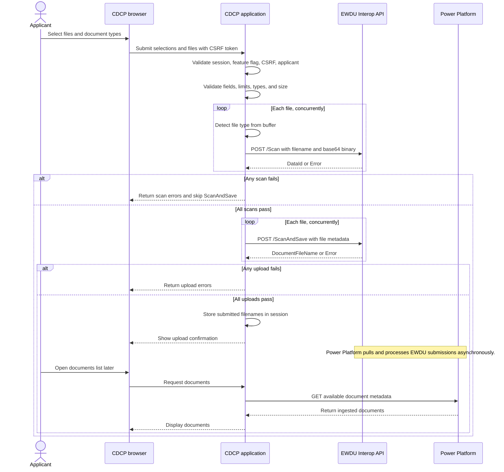

# Document Upload Feature

## Contents

- [Purpose and Summary](#purpose-and-summary)
- [Key Terms](#key-terms)
- [Scope and Access](#scope-and-access)
- [End-to-End Process](#end-to-end-process)
  - [Submission and validation](#1-submission-and-validation)
  - [EWDU processing](#2-ewdu-processing)
  - [Power Platform metadata and retrieval](#3-power-platform-metadata-and-retrieval)
- [Filename and Data Sharing](#filename-and-data-sharing)
  - [Filename handling](#filename-handling)
  - [Data collected and shared](#data-collected-and-shared)
  - [Data kept for validation or control](#data-kept-for-validation-or-control)
- [Implementation Touch Points](#implementation-touch-points)
- [Configuration, Security, and Operations](#configuration-security-and-operations)
  - [Runtime settings](#runtime-settings)
  - [Retry behavior](#retry-behavior)
  - [Security and privacy](#security-and-privacy)
- [Failure and Consistency Behavior](#failure-and-consistency-behavior)

## Purpose and Summary

This document describes the current Canadian Dental Care Plan (CDCP) protected document upload implementation. It is a shared reference for business, support, and technical teams working with Enterprise Wide Document Upload (EWDU) and Power Platform.

**Status:** Current implementation reference, reviewed 2026-07-21.

The feature is a protected MSCA workflow for submitting evidentiary documents for the authenticated applicant. The browser sends file data to the CDCP server, which validates and submits files to EWDU:

1. The user selects files and a document type for each file.
2. The CDCP server validates the submission and computes a SHA-256 hash for each file. Duplicate files are allowed.
3. The server checks each file extension and detected content type.
4. The server sends each file to EWDU through the Interop API `Scan` operation.
5. Only after every file passes scanning does the server send the files to EWDU through `ScanAndSave`.
6. After EWDU accepts all uploads, the server stores submitted filenames in the session and shows an immediate confirmation.
7. Power Platform pulls and processes EWDU submissions asynchronously. The documents list shows records after that process makes them available.

EWDU owns threat scanning and the predetermined drop location. Power Platform owns downstream ingestion and the evidentiary-document records shown in the CDCP documents list. DTS does not create Power Platform metadata as part of the synchronous upload request.
@@## End-to-End Process

## Key Terms

| Term                 | Meaning                                                                                                          |
| -------------------- | ---------------------------------------------------------------------------------------------------------------- |
| CDCP                 | Canadian Dental Care Plan.                                                                                       |
| MSCA                 | My Service Canada Account, the authenticated portal used to access this feature.                                 |
| EWDU                 | Enterprise Wide Document Upload, the service that scans files and saves them to its predetermined drop location. |
| Interop API          | Integration layer used by CDCP to communicate with EWDU and Power Platform.                                      |
| Power Platform       | System that stores evidentiary-document metadata and provides the submitted-documents list data.                 |
| Client ID            | Power Platform identifier for the applicant record.                                                              |
| Client number        | Applicant identifier sent to EWDU as `subjectPersonIdentificationID`.                                            |
| Evidentiary document | Document submitted as evidence for a CDCP applicant.                                                             |

## Scope and Access

| Area                        | Current behavior                                                                                               |
| --------------------------- | -------------------------------------------------------------------------------------------------------------- |
| Feature flag                | `doc-upload` must be enabled.                                                                                  |
| Protected upload page       | `/en/protected/documents/upload` and `/fr/protege/documents/televerser`                                        |
| Submitted-document list     | `/en/protected/documents` and `/fr/protege/documents`                                                          |
| Documents-not-required page | `/en/protected/documents/not-required` and `/fr/protege/documents/non-requis`                                  |
| Supported target            | Primary enrolled applicant only. Child records are mapped server-side but are not currently offered in the UI. |
| Source route                | [`app/routes/protected/documents/upload/index.tsx`](../../app/routes/protected/documents/upload/index.tsx)     |

On page access, the server validates the feature flag, authenticated session, client application, and enrolled-applicant status. It redirects to the documents-not-required page when requirements are not met, loads applicant and document-type choices, and loads the dashboard URL.

## End-to-End Process


```mermaid
sequenceDiagram
    actor Applicant
    participant Browser as CDCP browser
    participant App as CDCP application
    participant EWDU as EWDU Interop API
    participant PP as Power Platform

    Applicant->>Browser: Select files and document types
    Browser->>App: Submit selections and files with CSRF token
    App->>App: Validate session, feature flag, CSRF, applicant
    App->>App: Validate fields, limits, types, and size
    loop Each file, concurrently
      App->>App: Detect file type from buffer
      App->>EWDU: POST /Scan with filename and base64 binary
      EWDU-->>App: DataId or Error
    end
    alt Any scan fails
      App-->>Browser: Return scan errors and skip ScanAndSave
    else All scans pass
      loop Each file, concurrently
        App->>EWDU: POST /ScanAndSave with file metadata
        EWDU-->>App: DocumentFileName or Error
      end
      alt Any upload fails
        App-->>Browser: Return upload errors
      else All uploads pass
        App->>App: Store submitted filenames in session
        App-->>Browser: Show upload confirmation
        Note over EWDU,PP: Power Platform pulls and processes EWDU submissions asynchronously.
        Applicant->>Browser: Open documents list later
        Browser->>App: Request documents
        App->>PP: GET available document metadata
        PP-->>App: Return ingested documents
        App-->>Browser: Display documents
      end
    end
```

### 1. Submission and validation

The user selects an applicant, one or more files, and a document type for each file. The application submits the selections and files to the server as a multipart request protected by a CSRF token. The browser provides immediate feedback, but the server repeats validation with server configuration and remains the security boundary.

The same validation rules apply in the browser and on the server. Current defaults:

| Setting            | Current default                                                                                             | Source                                    |
| ------------------ | ----------------------------------------------------------------------------------------------------------- | ----------------------------------------- |
| Allowed extensions | `.pdf`, `.docx`, `.rtf`, `.xlsx`, `.pptx`, `.txt`, `.jpg`, `.jpeg`, `.png`, `.gif`, `.bmp`, `.tif`, `.tiff` | `DOCUMENT_UPLOAD_ALLOWED_FILE_EXTENSIONS` |
| Maximum file size  | 5 MB per file                                                                                               | `DOCUMENT_UPLOAD_MAX_FILE_SIZE_MB`        |
| Maximum file count | 10 files per submission                                                                                     | `DOCUMENT_UPLOAD_MAX_FILE_COUNT`          |

Validation rules include:

- An applicant is required.
- At least one file is required.
- The number of files must not exceed the configured maximum.
- The filename extension must be allowed.
- The file size must not exceed the configured maximum.
- A document type is required for every file.
- Duplicate files are allowed and submitted separately, including files with identical names and contents. The upload route does not call the retained duplicate-detection utility.
- The file content is inspected with `file-type` when scanning. If no type is detected, only a declared `text/plain` file is accepted. A detected MIME type must map to one of the configured extensions.

The server reads each file while parsing the submission, computes its SHA-256 hash, and converts the binary to base64 for downstream requests. The hash is not used to reject duplicate files.

### 2. EWDU processing

#### Scan

For each validated file, the server calls `DocumentUploadService.scanDocument()`. The service maps the request to EWDU format and calls `DocumentUploadRepository.scanDocument()`.

All file scans run concurrently. The server waits for the complete batch and returns errors for failed files. Any scan failure stops the upload phase for the entire submission.

A scan request sent to EWDU has this logical shape:

```json
{
  "filename": "evidence.pdf",
  "binary": "<base64 file bytes>",
  "username": "<EWDU encapsulation username>",
  "password": "<EWDU encapsulation password>",
  "programActivityIdentificationID": "<program activity ID>"
}
```

The current adapter sends this request to:

```text
POST {INTEROP_API_BASE_URI}/client-correspondence/document-upload/cct/v1/api/Scan
```

Headers:

- `Content-Type: application/json`
- `Ocp-Apim-Subscription-Key: {INTEROP_API_SUBSCRIPTION_KEY}`

The successful response contains `DataId`; a downstream error contains `ErrorCode` and `ErrorMessage`. Non-success HTTP responses are logged and raised as exceptions. The application converts caught failures into a localized generic scan error.

#### ScanAndSave

After the complete scan batch succeeds, the server sends each file through `DocumentUploadService.uploadDocument()`. The service resolves the selected document type ID to its configured code, maps the request to EWDU format, and calls the repository.

The upload request has this logical shape:

```json
{
  "filename": "evidence.pdf",
  "binary": "<base64 file bytes>",
  "subjectPersonIdentificationID": "<client number>",
  "documentCategoryText": "<document type code>",
  "originalDocumentCreationDate": "2026-07-21T00:00:00.000Z",
  "username": "<EWDU encapsulation username>",
  "password": "<EWDU encapsulation password>",
  "programActivityIdentificationID": "<program activity ID>"
}
```

The current adapter sends this request to:

```text
POST {INTEROP_API_BASE_URI}/client-correspondence/document-upload/cct/v1/api/ScanAndSave
```

Headers and error handling match the scan operation. The successful response contains `DocumentFileName`.

The client number comes from the selected applicant ID. `documentCategoryText` is not the display label; it is the code loaded by `EvidentiaryDocumentTypeService` for the selected Power Platform document-type ID.

### 3. Power Platform background ingestion and retrieval

After EWDU accepts the upload, a Power Platform background process pulls and processes the submitted documents. This runs asynchronously, outside the DTS upload request. DTS does not post document metadata to Power Platform or wait for ingestion to finish.

The immediate confirmation page uses filenames stored in the DTS session. It confirms successful EWDU submission, not completed Power Platform ingestion. Documents can appear in the list later, after Power Platform makes their records available.

When the user opens the documents page, DTS reads available evidentiary-document records from Power Platform through `EvidentiaryDocumentService`:

```text
GET {INTEROP_API_BASE_URI}/dental-care/doc-metadata/pp/v1/esdc_evidentiarydocuments
```

The query filters by selected client ID and active status, expands client and document-type relationships, and orders by upload date descending and filename ascending. The UI displays filename, applicant, localized document type name, and upload date. Power Platform owns background-ingestion timing and retries.

## Filename and Data Sharing

### Filename handling

The application does not generate a business filename. It preserves the original `File.name` supplied by the browser when the user selects or drops a file.

- `file_id` is an internal identifier generated with `crypto.randomUUID()`. It tracks the selected file in the UI, error responses, and confirmation list; it is not sent to EWDU or Power Platform.
- The original filename is used for extension validation and EWDU requests. Duplicate filenames are allowed.
- The server does not rename, sanitize, or add a timestamp to the filename before sending it downstream.
- The upload timestamp is generated separately by the server. It is not derived from the filename or the file's local creation date.

### Data collected and shared

| Flow                 | System behavior                                                                                                       |
| -------------------- | --------------------------------------------------------------------------------------------------------------------- |
| DTS upload           | DTS sends validated files and upload fields to EWDU. It does not send a metadata POST to Power Platform.              |
| Background ingestion | Power Platform pulls and processes EWDU submissions asynchronously. Power Platform owns ingestion timing and retries. |
| Documents list       | DTS requests available records from Power Platform when the user opens the documents page.                            |

### Data kept for validation or control

The following values are used by the CDCP server but are not included in EWDU or Power Platform request payloads:

- File size, used for the maximum-size check.
- Declared MIME type and detected file type, used for content validation.
- SHA-256 file hash, computed during validation but not used for duplicate detection. The duplicate-detection utility remains available for future use.
- CSRF token, used to protect the submission.
- Internal `file_id`, used to associate UI errors with selected files.

Power Platform later returns document metadata, client display names, and localized document-type names for the submitted-documents list. This is retrieval for display, not another file upload.

## Implementation Touch Points

Technical reference for developers and integration teams. Key implementation files:

- [`index.tsx`](../../app/routes/protected/documents/upload/index.tsx) and [`upload.server.ts`](../../app/routes/protected/documents/upload/upload.server.ts): route exports and the protected server-side loader, eligibility middleware, validation, EWDU scan/upload orchestration, and session-based confirmation.
- [`document-upload-instructions.tsx`](../../app/routes/protected/documents/upload/document-upload-instructions.tsx): localized eligibility and document requirements shown on the upload page.
- [`document-upload-form.tsx`](../../app/routes/protected/documents/upload/document-upload-form.tsx) and [`use-document-upload-form.ts`](../../app/routes/protected/documents/upload/use-document-upload-form.ts): accessible upload controls, client-side selection flow, file state, focus management, and multipart form submission.
- [`document-upload-service.ts`](../../app/.server/domain/services/document-upload-service.ts): EWDU service facade.
- [`document-upload-repository.ts`](../../app/.server/domain/repositories/document-upload-repository.ts): EWDU HTTP URLs, headers, credentials, retries, and response handling.
- [`document-upload-dto-ts`](../../app/.server/domain/dtos/document-upload-dto.ts): scan and upload DTO contracts.
- [`document-upload-dto-mapper.ts`](../../app/.server/domain/mappers/document-upload-dto-mapper.ts): maps CDCP DTOs to EWDU request fields and resolves document-type codes.
- [`evidentiary-document-repository.ts`](../../app/.server/domain/repositories/evidentiary-document-repository.ts): Power Platform document-list retrieval and metadata adapter methods. The upload route does not invoke its metadata POST operation.
- [`evidentiary-document-service.ts`](../../app/.server/domain/services/evidentiary-document-service.ts): service used by the documents list to read available records.
- [`env.utils-ts`](../../app/.server/utils/env-utils.ts): server-side integration and upload configuration schema.
- [`application-routes-reference.md`](./application-routes-reference.md): protected document route list.

The production bindings are configured through Inversify. `DefaultDocumentUploadRepository` is used unless the `document-upload` mock is enabled; the mock returns successful scan and upload responses without calling EWDU, except that uploading `mock-upload-failure.txt` returns an error to exercise upload failure recovery.

## Configuration, Security, and Operations

### Runtime settings

| Setting                                   | Purpose                                                 | Current default or source                                               |
| ----------------------------------------- | ------------------------------------------------------- | ----------------------------------------------------------------------- |
| `INTEROP_API_BASE_URI`                    | Base URI for EWDU and Power Platform Interop APIs       | Required; environment-specific                                          |
| `INTEROP_API_SUBSCRIPTION_KEY`            | Subscription key used by both adapters                  | Required; secret                                                        |
| `INTEROP_API_MAX_RETRIES`                 | Retry count for configured transient HTTP failures      | `3`                                                                     |
| `INTEROP_API_BACKOFF_MS`                  | Retry backoff                                           | `100` ms                                                                |
| `HTTP_PROXY_URL`                          | Optional proxy used by the HTTP client                  | Environment-specific                                                    |
| `EWDU_ENCAPSULATION_USERNAME`             | Credential added to EWDU request bodies                 | `CDCP`                                                                  |
| `EWDU_ENCAPSULATION_PASSWORD`             | Credential added to EWDU request bodies                 | Optional schema value; deployment secret                                |
| `EWDU_PROGRAM_ACTIVITY_ID`                | EWDU program activity identifier                        | `CDCP`                                                                  |
| `EWDU_RECORD_SOURCE_MSCA`                 | Metadata mapping configuration; not used by EWDU upload | `775170004`                                                             |
| `DOCUMENT_UPLOAD_ALLOWED_FILE_EXTENSIONS` | Browser and server extension allow-list                 | `.pdf,.docx,.rtf,.xlsx,.pptx,.txt,.jpg,.jpeg,.png,.gif,.bmp,.tif,.tiff` |
| `DOCUMENT_UPLOAD_MAX_FILE_SIZE_MB`        | Browser and server per-file size limit                  | `5`                                                                     |
| `DOCUMENT_UPLOAD_MAX_FILE_COUNT`          | Browser and server batch limit                          | `10`                                                                    |

The browser reads upload limits from client-exposed configuration, while the server reads them from server configuration. A deployment change must update both exposed and server-side values consistently, or users may see one set of rules while the server enforces another.

The DTS application uses the shared Interop API subscription key for EWDU requests and Power Platform document-list GET requests. Power Platform background-ingestion credentials and retries are managed outside the DTS upload flow. EWDU username, password, and program activity ID remain deployment-managed secrets and must not move into client-exposed environment variables.

### Retry behavior

| Operation                   | Retryable statuses currently configured |
| --------------------------- | --------------------------------------- |
| EWDU `Scan`                 | 502, 503, 504                           |
| EWDU `ScanAndSave`          | 502, 503, 504                           |
| Power Platform document GET | 502                                     |

Retries occur inside the shared instrumented HTTP client. Power Platform background-ingestion retries are owned by Power Platform. The DTS application does not implement a transaction, compensation, or resume token.

### Security and privacy

- Feature flag and authenticated-session checks run on page access and submission.
- The server validates the CSRF token before processing the multipart request.
- The selected client ID is resolved against the authenticated client application and then translated to a client number for EWDU.
- File bytes are sent from the server to downstream services as base64 JSON; they are not logged by the application or repository.
- The repository uses an Interop API subscription key and EWDU encapsulation credentials.
- The frontend does not trust browser validation; the server repeats all upload validation.

## Failure and Consistency Behavior

The current implementation is batch-oriented but not transactional across systems:

- Validation failure: no downstream calls are made.
- Any scan failure: no file is sent to `ScanAndSave`.
- Upload failure for one file: other concurrent EWDU uploads may already have succeeded. The application returns errors and does not show a success confirmation for the batch.
- Power Platform ingestion is asynchronous. DTS can show EWDU submission confirmation before records appear in the documents list. Ingestion failures and retries belong to the Power Platform background process.
- After a partial upload failure, the form retains successful files separately and retries only pending files. Both collections count toward the file-selection limit. The upload contract has no idempotency key, so independently resubmitting a successful file can still create a duplicate.
- The immediate confirmation uses session data. The documents page retrieves records from Power Platform when the user opens the list; newly submitted files can appear after background ingestion completes.

These behaviors are important acceptance criteria for any EWDU or Power Platform change. Changes to background ingestion require updates to Power Platform monitoring and operations. DTS changes must preserve EWDU submission and explain the delay before documents appear in the list.
