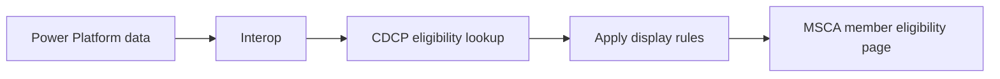

# Member Eligibility Feature

## Contents

- [Purpose and Summary](#purpose-and-summary)
- [Scope and Access](#scope-and-access)
- [User and System Flow](#user-and-system-flow)
- [Eligibility Data](#eligibility-data)
- [Eligibility Decision Rules](#eligibility-decision-rules)
- [Benefit Years](#benefit-years)
- [Member Experience](#member-experience)

## Purpose and Summary

This document describes the current Canadian Dental Care Plan (CDCP) member eligibility feature in MSCA. It is a shared reference for business, support, and technical teams investigating the page, its data, its business rules, or changes to its behavior.

**Status:** Current implementation reference, reviewed 2026-07-21.

## Feature Overview

The page shows eligibility for the primary applicant and children associated with the authenticated client application. It retrieves eligibility information through Interop from Power Platform, combines it with member identity information, applies the benefit-year rules, and displays a status for each member.

At a high level:

1. The member opens the protected page.
2. The application confirms the session and client application.
3. The application requests information for the primary applicant and children.
4. The application matches returned data to each member.
5. The application calculates the status for the current benefit year and, when applicable, the next benefit year.
6. The page displays the result and any related action link.

The page does not display raw Power Platform values. It uses mapped eligibility fields and configured business rules to produce the visible result.

## Scope and Access

| Area                 | Current behavior                                                        |
| -------------------- | ----------------------------------------------------------------------- |
| English page         | `/en/protected/profile/eligibility`                                     |
| French page          | `/fr/protege/profil/admissibilite`                                      |
| People shown         | Primary applicant and children in the authenticated client application. |
| Access               | Authenticated MSCA session and client application required.             |
| Current benefit year | Always shown.                                                           |
| Next benefit year    | Shown only during the configured renewal period.                        |

The member cannot select another person manually. The application uses the primary applicant and children already associated with the authenticated client application.

## User and System Flow

1. The member opens or reloads the eligibility page.
2. The application confirms the MSCA session and client application.
3. The application identifies the primary applicant and children using their client numbers.
4. The application requests eligibility information through Interop.
5. Interop returns information sourced from Power Platform.
6. The application matches the returned information to each member.
7. The application applies the display rules for the current or next benefit year.
8. MSCA displays the result for each member.

The page uses member names and identity information from the authenticated client application. It uses eligibility information returned through Interop for the status calculation.

## Eligibility Data

| Information returned through Power Platform | How the page uses it                                                                          |
| ------------------------------------------- | --------------------------------------------------------------------------------------------- |
| Applicant current-year eligibility status   | Checked first for the current benefit year.                                                   |
| Applicant next-year eligibility status      | Checked first for the next benefit year, when that section is displayed.                      |
| Earning taxation year                       | Identifies which earning record belongs to the requested benefit year.                        |
| Earning eligibility status                  | Used when no applicant-level status is available.                                             |
| `Co-Pay Tier (TPC)` coverage value          | Must contain a valid configured tier for an earning to produce `Eligible`.                    |
| Enrollment status                           | Collected in the eligibility response but not used by this page to choose its visible status. |

The eligibility response includes client identifiers and names, but the service matches returned records to page members by client number. The route uses the authenticated client application's client ID as an internal row key and displays the member's first and last name. The identity fields do not determine eligibility.

## Eligibility Decision Rules

### Power Platform Data Mapping

Interop returns the following Power Platform fields for each applicant. The application maps them into the values used by the decision rules:

| Power Platform response field                                                                         | Mapped value used by MSCA                 | Decision rule or display impact                                                                                        |
| ----------------------------------------------------------------------------------------------------- | ----------------------------------------- | ---------------------------------------------------------------------------------------------------------------------- |
| `Applicant.BenefitEligibilityStatus.` `StatusCode.ReferenceDataID`                                 | Applicant current-year eligibility status | Checked first for the current benefit year. Eligible code displays `Eligible`; any other code displays `Not eligible`. |
| `Applicant.BenefitEligibilityNextYearStatus.` `StatusCode.ReferenceDataID`                         | Applicant next-year eligibility status    | Checked first for the next benefit year when that section is displayed.                                                |
| `Applicant.ApplicantEarning[].` `EarningTaxationYear.YearDate`                                     | Earning taxation year                     | Identifies the earning record used for the requested benefit year.                                                     |
| `Applicant.ApplicantEarning[].BenefitEligibilityStatus.` `StatusCode.ReferenceDataID`              | Earning eligibility status                | Used only when no applicant-level status is available.                                                                 |
| `Applicant.ApplicantEarning[].Coverage[].` `CoverageCategoryCode.ReferenceDataName`                | Coverage category                         | The category must match `Co-Pay Tier (TPC)` for the coverage to be considered.                                         |
| `Applicant.ApplicantEarning[].Coverage[].CoverageCategoryCode.` `CoverageTierCode.ReferenceDataID` | TPC coverage tier                         | The tier must be one of the configured valid values for an earning to support `Eligible`.                              |
| `Applicant.ApplicantEnrollmentStatus.` `StatusCode.ReferenceDataID`                                | Enrollment status                         | Collected but not used by this page to determine `Eligible`, `Not eligible`, or `Not enrolled`.                        |

The mapper also reads `ClientIdentification` and `PersonName` values to validate and normalize the eligibility response. The route uses the client number as the join key and uses the authenticated client application's client ID and name for page display; these identity fields do not determine eligibility.

The page evaluates each member separately and follows this order:

1. Check the applicant-level eligibility status for the benefit year.
2. If that status exists:
   - Eligible status code means `Eligible`.
   - Any other status code means `Not eligible`.
3. If no applicant-level status exists, find an earning record for the requested taxation year.
4. If no matching earning record exists, show `Not enrolled`.
5. If a matching earning record exists, show `Eligible` only when:
   - The earning eligibility status is eligible; and
   - The earning has a valid `Co-Pay Tier (TPC)` coverage value.
6. Otherwise, show `Not eligible`.

### Important Interpretation

- Applicant-level eligibility status takes priority over earning information.
- An eligible earning does not override a non-eligible applicant-level status.
- An earning with an eligible status but without a valid TPC coverage value displays as `Not eligible`.
- `Not enrolled` on this page means that no earning record was found for the requested taxation year after the applicant-level status check.
- `Not enrolled` does not mean that the page checked Sun Life enrollment and found the member absent.
- The enrollment status field is not used by the page's status calculation.

## Example Outcomes

| Data available for member                                                             | Page result                                            |
| ------------------------------------------------------------------------------------- | ------------------------------------------------------ |
| Applicant-level status is eligible                                                    | `Eligible`                                             |
| Applicant-level status is not eligible                                                | `Not eligible`, even if an earning record is eligible. |
| No applicant-level status; matching earning is eligible and has valid TPC coverage    | `Eligible`                                             |
| No applicant-level status; matching earning is eligible but has no valid TPC coverage | `Not eligible`                                         |
| No applicant-level status and no earning for the requested taxation year              | `Not enrolled`                                         |
| No eligibility response matched to the member                                         | Normally `Not enrolled`.                               |

## Benefit Years

The application calculates the current benefit year from today's date:

- July through December: July 1 of the current year to June 30 of the next year.
- January through June: July 1 of the previous year to June 30 of the current year.
- The taxation year used for the current benefit year is the coverage start year minus one.

On 2026-07-21, the current benefit year is July 1, 2026 to June 30, 2027, and the related taxation year is 2025.

The next benefit-year section is shown only during the configured renewal period. The renewal period includes its start and end dates. Outside that period, the current-year section remains visible and the next-year section is hidden.

## Member Experience

| Result       | English      | French         | Page behavior                           |
| ------------ | ------------ | -------------- | --------------------------------------- |
| Eligible     | Eligible     | Admissible     | Positive status indicator.              |
| Not eligible | Not eligible | Non admissible | Negative status indicator.              |
| Not enrolled | Not enrolled | Non inscrit(e) | Warning indicator and application link. |

The page displays the primary applicant first, followed by children. It shows the member's first and last name beside the result. The page also provides a link back to the dashboard.
