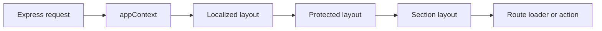

# React Router Middleware

This application uses React Router middleware for request-level validation and for loading data shared by descendant routes. Express middleware is documented separately in [Express](./express.md).

## Request context

The Express request handler creates a `RouterContextProvider` for every request. It stores `appContext`, which provides:

- the request-scoped session
- the application dependency injection container

React Router middleware reads those dependencies and may add more specific values to the same context. Descendant middleware, loaders, and actions can then consume those values without repeating the lookup.



Middleware runs from parent routes to child routes. Within one route, it runs in array order. Middleware that calls `next()` continues the chain; errors, responses, and redirects can stop it.

## Shared middleware

Shared middleware lives in `app/middlewares`.

| Middleware                         | Responsibility                                                            | Provides                                   | Current registration                                 |
| ---------------------------------- | ------------------------------------------------------------------------- | ------------------------------------------ | ---------------------------------------------------- |
| `csrfMiddleware`                   | Rejects requests from untrusted origins with HTTP 403.                    | None                                       | Localized layout                                     |
| `csrfTokenMiddleware`              | Creates the signed CSRF token cookie and validates submitted form tokens. | CSRF token accessed through `getCsrfToken` | Localized layout                                     |
| `authMiddleware`                   | Validates the RAOIDC session and confirms token identities.               | `userContext`                              | Protected layout and protected application-state API |
| `createFeatureMiddleware(feature)` | Creates a guard that validates one configured feature before continuing.  | None                                       | Documents and Letters layouts                        |
| `applicantMiddleware`              | Resolves an applicant. The applicant category may be absent.              | `applicantContext`                         | Documents and Letters layouts                        |
| `programApplicantMiddleware`       | Resolves a program applicant and requires an applicant category.          | `programApplicantContext`                  | Not currently registered                             |
| `clientApplicationMiddleware`      | Resolves the current client application.                                  | `clientApplicationContext`                 | Profile layout                                       |

## Route-local middleware

Some middleware belongs to one route and remains colocated with it.

| Middleware                          | Location                                    | Responsibility                                                                                                                               |
| ----------------------------------- | ------------------------------------------- | -------------------------------------------------------------------------------------------------------------------------------------------- |
| `appLocaleMiddleware`               | `app/routes/localized-layout.tsx`           | Validates the `:lang` parameter before localized routes run. Invalid locales receive HTTP 404.                                               |
| `appealUploadEligibilityMiddleware` | `app/routes/protected/documents/upload.tsx` | Requires at least one application paused because of a T4 mismatch. Ineligible applicants are redirected to the documents not-required route. |

## Current route setup

### Localized routes

All localized public and protected routes inherit this chain:

```text
appLocaleMiddleware
  -> csrfMiddleware
  -> csrfTokenMiddleware
```

The localized layout loader reads the generated CSRF token and provides it to `AuthenticityTokenProvider`.

### Protected routes

All routes below the protected layout inherit `authMiddleware` after the localized chain. This means their loaders, actions, and nested middleware can read `userContext`.

```text
appLocaleMiddleware
  -> csrfMiddleware
  -> csrfTokenMiddleware
  -> authMiddleware
```

### Documents

The Documents layout first checks the `doc-upload` feature, then resolves the broad applicant shape. An applicant without `applicantType` can access this section.

```text
protected chain
  -> createFeatureMiddleware('doc-upload')
  -> applicantMiddleware
```

The upload route adds `appealUploadEligibilityMiddleware`. It consumes the `applicantContext` provided by the Documents layout.

### Letters

The Letters layout first checks the `view-letters` feature, then resolves the broad applicant shape. An applicant without `applicantType` can access this section.

```text
protected chain
  -> createFeatureMiddleware('view-letters')
  -> applicantMiddleware
```

### Profile

The Profile layout resolves the client application once for the whole profile section. Profile loaders and actions consume `clientApplicationContext` through `getClientApplication`.

```text
protected chain
  -> clientApplicationMiddleware
```

### Protected application-state API

The unlocalized protected application-state API is outside the localized layout tree. It registers `authMiddleware` directly.

```text
authMiddleware
```

## Context consumers

Use the context getter associated with the middleware that owns the data:

| Context                    | Getter                          | Required middleware           |
| -------------------------- | ------------------------------- | ----------------------------- |
| `userContext`              | `getUser(context)`              | `authMiddleware`              |
| `applicantContext`         | `getApplicant(context)`         | `applicantMiddleware`         |
| `programApplicantContext`  | `getProgramApplicant(context)`  | `programApplicantMiddleware`  |
| `clientApplicationContext` | `getClientApplication(context)` | `clientApplicationMiddleware` |

The getters fail fast when their context is unavailable. Register the producing middleware on the nearest common parent layout rather than repeating service calls in child loaders or actions.

## Adding middleware

- Put reusable React Router middleware in `app/middlewares` and use the `.server.ts` suffix.
- Keep route-specific middleware beside the route that owns the rule.
- Register shared data loaders on the nearest common parent layout.
- Run inexpensive feature checks before remote applicant or application lookups.
- Use separate contexts when the resolved types have different guarantees. In particular, do not replace `programApplicantContext` with the broader `applicantContext` on program-only routes.
- Preserve parent-child dependencies when moving routes. For example, the upload eligibility middleware requires the Documents layout to run first.

## Tests

Direct middleware tests live in `__tests__/middlewares`. Route-layout wiring tests live beside the corresponding route tests under `__tests__/routes`.

Middleware tests should verify:

- the expected service or guard is called
- context is populated before `next()` runs
- the downstream response is returned
- failures stop the chain

Layout tests should verify the configured middleware and declaration order.
